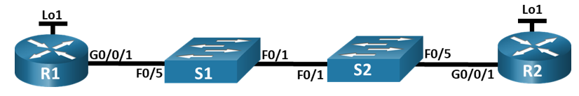
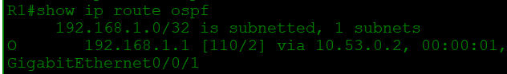
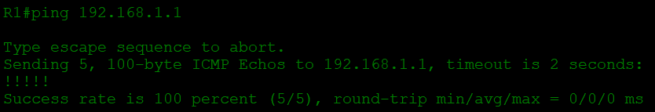
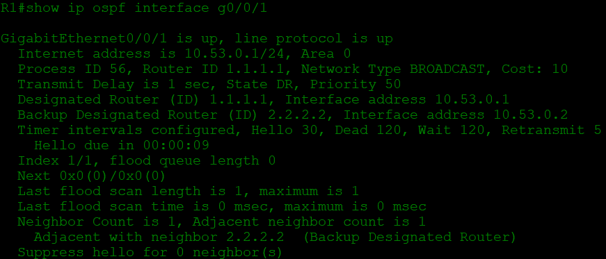
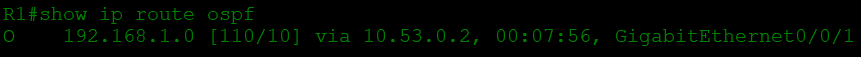
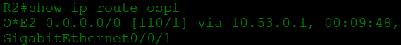
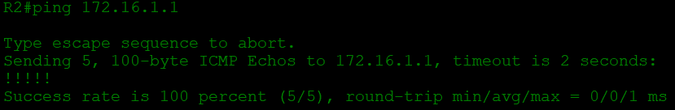

# Настройка протокола OSPFv2 для одной области
## Топология

## Таблица адресации
Устройство | interface | IP-адрес | Маска подсети
--- | --- | --- | ---
R1 | G0/0/1 | 10.53.0.1 | 255.255.255.0
_ | Loopback1 | 172.16.1.1 | 255.255.255.0
R2 | G0/0/1 | 10.53.0.2 | 255.255.255.0
_ | Loopback1 | 192.168.1.1 | 255.255.255.0
## Цели
1. **Создание сети и настройка основных параметров устройства**
2. **Настройка и проверка базовой работы протокола  OSPFv2 для одной области**
3. **Оптимизация и проверка конфигурации OSPFv2 для одной области**
## Решение
### 1. Создание сети и настройка основных параметров устройства
Подключим устройства, как показано в топологии, и подсоединим необходимые кабели, после чего:
 * Назначим имена устройств.
 * Отключим поиск DNS, чтобы предотвратить попытки устройств неверно преобразовывать введенные команды таким образом, как будто они являются именами узлов.
 * Назначим class в качестве зашифрованного пароля привилегированного режима EXEC.
 * Назначим cisco в качестве пароля консоли и включите вход в систему по паролю.
 * Назначим cisco в качестве пароля VTY и включите вход в систему по паролю.
 * Зашифруем открытые пароли.
 * Создадим баннер с предупреждением о запрете несанкционированного доступа к устройству.
 * Сохраним текущую конфигурацию в файл загрузочной конфигурации.
 ### 2. Настройка и проверка базовой работы протокола  OSPFv2 для одной области
 * Настроим адреса интерфейсов на каждом маршрутизаторе, как показано в таблице адресации выше.
 * Перейдём в режим конфигурации маршрутизатора OSPF, используя идентификатор процесса 56, где настроим статический идентификатор маршрутизатора для каждого маршрутизатора (1.1.1.1 для R1, 2.2.2.2 для R2), а также инструкцию сети для сети между R1 и R2, поместив ее в область 0.

`router ospf 56`

`router-id 1.1.1.1 (2.2.2.2)`

`network 10.53.0.0 0.0.0.255 area 0`

 * Только на R2 добавим конфигурацию, необходимую для объявления сети Loopback 1 в область OSPF 0.

`R2(config)# interface loopback1`

`R2(config-if)# ip ospf 56 area 0`

 * Убедимся, что OSPFv2 работает между маршрутизаторами, выполниы команду `show ip ospf neighbor`. Какой из роутеров стал **DR**,  а какой **BDR**, показано в колонке *STATE*. Назначение происходит на основаниии *Router-ID*, роутер с наивысшим *ID*, становится **DR**, второй по велечине **BDR**, остальные **DROTHER**.
 * На R1 выполним команду `show ip route ospf`, чтобы убедиться, что сеть **R2 Loopback1** присутствует в таблице маршрутизации. Обратим внимание, что поведение OSPF по умолчанию заключается в объявлении интерфейса обратной связи в качестве маршрута узла с использованием 32-битной маски.

 * Запустим `ping` до  адреса интерфейса **R2 Loopback 1** из **R1**. Выполнение команды ping должно быть успешным.

### 3. Оптимизация и проверка конфигурации OSPFv2 для одной области
**Шаг 1. Реализация различных оптимизаций на каждом маршрутизаторе.**
 * На **R1** настроим приоритет *OSPF* интерфейса **G0/0/1** на 50, чтобы убедиться, что R1 является назначенным маршрутизатором - `ip ospf priority 50`.
 * Настроим таймеры *OSPF* на **G0/0/1** каждого маршрутизатора для hello и dead интервалов, составляющих 30 и 120 секунд соответственно - `ip ospf hello-interval 30`; `ip ospf dead-interval 120`.
 * На R1 настройте статический маршрут по умолчанию, который использует интерфейс Loopback 1 в качестве интерфейса выхода. Затем распространите маршрут по умолчанию в OSPF. Обратите внимание на сообщение консоли после установки маршрута по умолчанию.

`R1(config)#ip route 0.0.0.0 0.0.0.0 loopack 1`

`%Default route without gateway, if not a point-to-point interface, may impact performance`

`R1(config)#router ospf 56`

`R1(config-router)#default-information originate`

 * добавьте конфигурацию, необходимую для OSPF для обработки R2 Loopback 1 как сети точка-точка. Это приводит к тому, что OSPF объявляет Loopback 1 использовать маску подсети интерфейса.

`R2(config)#interface loopback 1`

`R2(config-if)#ip ospf network point-to-point`

`R2(config-if)#exit`

 * Только на R2 добавьте конфигурацию, необходимую для предотвращения отправки объявлений OSPF в сеть Loopback 1.

`R2(config)#router ospf 56`

`R2(config-router)#passive-interface loopback 1`

 * ИзмениМ базовую пропускную способность для маршрутизаторов. После этой настройки перезапустим *OSPF*. Обратим внимание на сообщение консоли после установки новой опорной полосы пропускания, которая говорит убедиться, что контрольная полоса пропускания одинакова для всех маршрутизаторов

`R..(config)#router ospf 56`

`R..(config-router)#auto-cost reference-bandwidth 1000`

`R..#clear ip ospf process`

**Шаг 2. Убедитесь, что оптимизация OSPFv2 реализовалась.**

 * Выполним команду `show ip ospf interface g0/0/1` на **R1** и убедимся, что приоритет интерфейса установлен равным 50, а временные интервалы — Hello 30, Dead 120, а тип сети по умолчанию — Broadcast

 * На R1 выполните команду show ip route ospf, чтобы убедиться, что сеть R2 Loopback1 присутствует в таблице маршрутизации. Обратите внимание на разницу в метрике между этим выходным и предыдущим выходным. Также обратите внимание, что маска теперь составляет 24 бита, в отличие от 32 битов, ранее объявленных.

 

 * Введём команду `show ip route ospf` на маршрутизаторе **R2**. Единственная информация о маршруте OSPF должна быть распространяемый по умолчанию маршрут R1.

 

 * Запустим Ping до адреса интерфейса **R1 Loopback 1** из **R2**. Выполнение команды ping должно быть успешным.

 

Почему стоимость OSPF для маршрута по умолчанию отличается от стоимости OSPF в R1 для сети 192.168.1.0/24? - Статическому маршруту, импортированному в OSPF по умолчанию, присваивается тип метрики “E2”. При использовании “E2” по умолчанию стоимость OSPF для всей сети OSPF остается неизменной. В данном случае показатель для маршрута по умолчанию был равен 1, поэтому он имеет значение 1 везде в сети OSPF 56.
