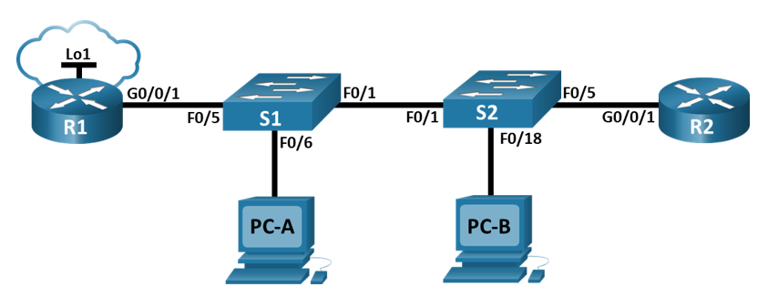
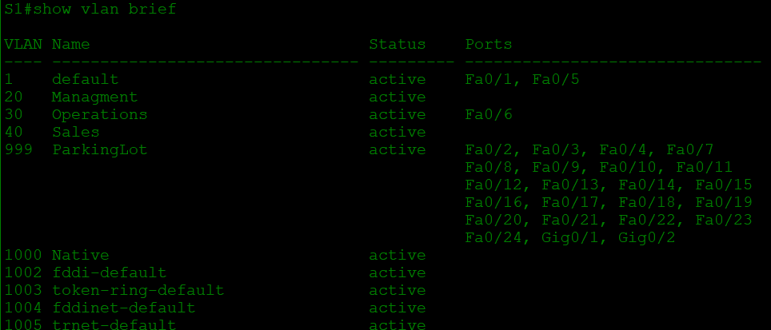
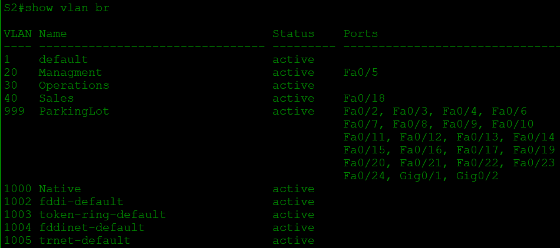
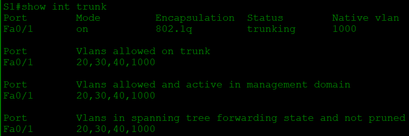
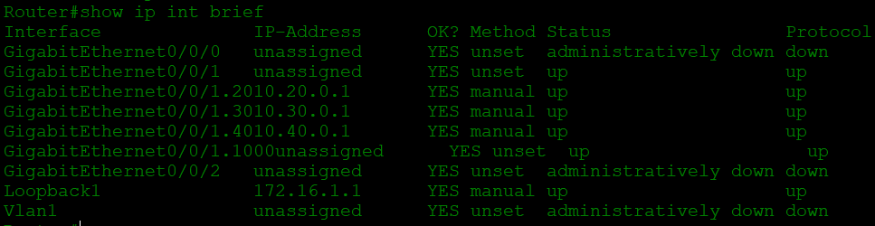

# Настройка и проверка расширенных списков контроля доступа.
## Топология

## Таблица адресации
Устройство | interface | IP-адрес | Маска подсети | Шлюз по умолчанию
--- | --- | --- | --- | ---
R1 | G0/0/1 | _ | _ | _
_ | G0/0/1.20 | 10.20.0.1 | 255.255.255.0 | _
_ | G0/0/1.30 | 10.30.0.1 | 255.255.255.0 | _
_ | G0/0/1.40 | 10.40.0.1 | 255.255.255.0 | _
_ | G0/0/1.1000 | _ | _ | _
_ | Loopback1 | 172.16.1.1 | 255.255.255.0 | _
R2 | G0/0/1 | 10.20.0.4 | 255.255.255.0 | _
S1 | VLAN 20 | 10.20.0.2 | 255.255.255.0 | 10.20.0.1
S2 | VLAN 20 | 10.20.0.3 | 255.255.255.0 | 10.20.0.1
PC-A | NIC | 10.30.0.10 | 255.255.255.0 | 10.30.0.1
PC-B | NIC | 10.40.0.10 | 255.255.255.0 | 10.40.0.1
## Таблица VLAN
VLAN | Имя | Назначенный интерфейс
--- | --- | ---
20 | Managment | S2: f0/5
30 | Operations | S1: f0/6 
40 | Sales | S2: F0/18
999 | ParkingLot |*S1: F0/2-4, F0/7-24, G0/1-2*;  **S2: F0/2-4, F0/6-17, F0/19-24, G0/1-2**
1000 | Native | _
## Задачи
1. **Создание сети и настройка основных параметров устройства**
2. **Настройка и проверка списков расширенного контроля доступа**
## Решение
### 1. Создание сети и настройка основных параметров устройства
Подключим устройства, как показано в топологии, и подсоединим необходимые кабели, после чего:
 * Назначим имена устройств.
 * Отключим поиск DNS, чтобы предотвратить попытки устройств неверно преобразовывать введенные команды таким образом, как будто они являются именами узлов.
 * Назначим class в качестве зашифрованного пароля привилегированного режима EXEC.
 * Назначим cisco в качестве пароля консоли и включите вход в систему по паролю.
 * Назначим cisco в качестве пароля VTY и включите вход в систему по паролю.
 * Зашифруем открытые пароли.
 * Создадим баннер с предупреждением о запрете несанкционированного доступа к устройству.
 * Сохраним текущую конфигурацию в файл загрузочной конфигурации.
### 2. Настройка и проверка списков расширенного контроля доступа
#### Часть 1. Настройка сетей VLAN на коммутаторах.
##### Шаг 1. Создайте сети VLAN на коммутаторах.
 * Создадим необходимые VLAN и назовём их на каждом коммутаторе из приведенной выше таблицы.
 * Настроим интерфейс управления и шлюз по умолчанию на каждом коммутаторе, используя информацию об IP-адресе в таблице адресации. 
 * Назначим все неиспользуемые порты коммутатора VLAN Parking Lot, настроим их для статического режима доступа и административно деактивируем их.
##### Шаг 2. Назначьте сети VLAN соответствующим интерфейсам коммутатора.
 * Назначим используемые порты соответствующей VLAN (указанной в таблице VLAN выше) и настроим их для режима статического доступа.
 * Выполним команду `show vlan brief`, чтобы убедиться, что сети VLAN назначены правильным интерфейсам

#### Часть 2. Настройте транки (магистральные каналы).
##### Шаг 1. Вручную настройте магистральный интерфейс F0/1.
 * Изменим режим порта коммутатора на интерфейсе **F0/1**, чтобы принудительно создать магистральную связь.
 * В рамках конфигурации транка установим для **native vlan** значение **1000** на обоих коммутаторах.
 * В качестве другой части конфигурации транка укажем, что **VLAN 10, 20, 30 и 1000** разрешены в транке.
 * Выполним команду `show interfaces trunk` для проверки портов магистрали, собственной VLAN и разрешенных VLAN через магистраль

 

Такой же результат на **S2**
##### Шаг 2. Вручную настройте магистральный интерфейс F0/5 на коммутаторе S1.
 * Настроим интерфейс **S1 F0/5** с теми же параметрами транка, что и **F0/1**. Это транк до маршрутизатора.
 * Сохраним текущую конфигурацию в файл загрузочной конфигурации.
 * Используем команду `show interfaces trunk` для проверки настроек транка.
#### Часть 3. Настройте маршрутизацию.
##### Шаг 1. Настройка маршрутизации между сетями VLAN на R1.
 * Активируйте интерфейс **G0/0/1** на маршрутизаторе.
 * Настройте подинтерфейсы для каждой VLAN, как указано в таблице IP-адресации. Все подинтерфейсы используют инкапсуляцию 802.1Q. Убедитесь, что подинтерфейс для собственной VLAN не имеет назначенного IP-адреса. Включите описание для каждого подинтерфейса. Пример:

`R1(config)#interface g0/0/1.20`

`R1(config-subif)#description Management Network`

`R1(config-subif)#encapsulation dot1q 20`

`R1(config-subif)#ip address 10.20.0.1 255.255.255.0`

 * Настройте интерфейс **Loopback 1** на **R1** с адресацией из приведенной выше таблицы.
 * С помощью команды `show ip interface brief` проверьте конфигурацию подынтерфейса.

##### Шаг 2. Настройка интерфейса R2 g0/0/1 с использованием адреса из таблицы и маршрута по умолчанию с адресом следующего перехода 10.20.0.1
R2(config)# interface g0/0/1
R2(config-if)# ip address 10.20.0.4 255.255.255.0
R2(config-if)# no shutdown
R2(config-if)# exit
R2(config)# ip route 0.0.0.0 0.0.0.0 10.20.0.1

ip route 0.0.0.0 0.0.0.0 10.20.0.1
interface g0/0/1
ip address 10.20.0.4 255.255.255.0
no shutdown
exit

