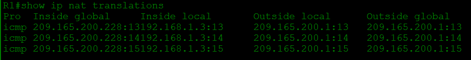

# Настройка NAT для IPv4
## Топология

##  Таблица адресации
Устройство | Интерфейс | IP-адрес | Маска подсети
--- | --- | --- | ---
R1 | G0/0/0 | 209.165.200.230 | 255.255.255.248
_ | G0/0/1 | 192.168.1.1 | 255.255.255.0
R2 | G0/0/0 | 209.165.200.225 | 255.255.255.248
_ | Loopback1 | 209.165.200.1 | 255.255.255.224
S1 | VLAN 1 | 192.168.1.11 | 255.255.255.0
S2 | VLAN 1 | 192.168.1.12 | 255.255.255.0
PC-A | NIC | 192.168.1.2 | 255.255.255.0
PC-B | NIC | 192.168.1.3 | 255.255.255.0
## Цели 
1. **Создание сети и настройка основных параметров устройства**
2. **Настройка и проверка NAT для IPv4**
3. **Настройка и проверка PAT для IPv4**
4. **Настройка и проверка статического NAT для IPv4**
## Решение
### 1. Создание сети и настройка основных параметров устройства
#### Шаг 1. Подключите кабели сети согласно приведенной топологии
Подключим устройства в соответствии с топологией и подсоединим соответствующие кабели.
#### Шаг 2. Произведите базовую настройку маршрутизаторов.
 * Назначим маршрутизатору имя устройства.
 * Отключим поиск DNS, чтобы предотвратить попытки маршрутизатора неверно преобразовывать введенные команды таким образом, как будто они являются именами узлов.
 * Назначим class в качестве зашифрованного пароля привилегированного режима EXEC.
 * Назначим cisco в качестве пароля консоли и включим вход в систему по паролю.
 * Назначим cisco в качестве пароля VTY и включим вход в систему по паролю.
 * Зашифруем открытые пароли.
 * Создадим баннер с предупреждением о запрете несанкционированного доступа к устройству.
 * Настроим IP-адресации интерфейса, как указано в таблице выше.
 * Настроим маршрут по умолчанию. от R2 до  R1.
 * Сохраним текущую конфигурацию в файл загрузочной конфигурации.
#### Шаг 3. Настройте базовые параметры каждого коммутатора
 * Присвоим коммутатору имя устройства.
 * Отключим поиск DNS, чтобы предотвратить попытки маршрутизатора неверно преобразовывать введенные команды таким образом, как будто они являются именами узлов.
 * Назначим class в качестве зашифрованного пароля привилегированного режима EXEC.
 * Назначим cisco в качестве пароля консоли и включим вход в систему по паролю.
 * Назначим cisco в качестве пароля VTY и включим вход в систему по паролю.
 * Зашифруем открытые пароли.
 * Создадим баннер с предупреждением о запрете несанкционированного доступа к устройству.
 * Выключим все интерфейсы, которые не будут использоваться.
 * Настроим IP-адресации интерфейса, как указано в таблице выше.
 * Сохраним текущую конфигурацию в файл загрузочной конфигурации.
### 2. Настройка и проверка NAT для IPv4
#### Шаг 1. Настройте NAT на R1, используя пул из трех адресов 209.165.200.226-209.165.200.228. 
 * Настроим простой список доступа, который определяет, какие хосты будут разрешены для трансляции. В этом случае все устройства в локальной сети **R1** имеют право на трансляцию.

`R1(config)# access-list 1 permit 192.168.1.0 0.0.0.255` 

 * Создадим пул **NAT** и укажем ему имя и диапазон используемых адресов.

`R1(config)#ip nat pool PUBLIC_ACCESS 209.165.200.226 209.165.200.228 netmask 255.255.255.248` 
 
 * Настроим перевод, связывая ACL и пул с процессом преобразования.

`R1(config)# ip nat inside source list 1 pool PUBLIC_ACCESS `

*Примечание: Три очень важных момента. Во-первых, слово «inside» имеет решающее значение для работы такого рода NAT. Если вы опустить его, NAT не будет работать. Во-вторых, номер списка — это номер ACL, настроенный на предыдущем шаге. В-третьих, имя пула чувствительно к регистру.* 
 * Зададим внутренний (inside) интерфейс. 

`R1(config)# interface g0/0/1`

`R1(config-if)# ip nat inside`

 * Определим внешний (outside) интерфейс.

`R1(config)# interface g0/0/0`

`R1(config-if)# ip nat outside`

#### Шаг 2. Проверьте и проверьте конфигурацию. 
 * С **PC-B**,  запустим эхо-запрос интерфейса **Lo1** (209.165.200.1) на **R2**. На R1 отобразим таблицу **NAT** на **R1** с помощью команды `show ip nat translations`.

Вопросы:
1. Во что был транслирован внутренний локальный адрес PC-B? - **209.165.200.226**
2. Какой тип адреса NAT является переведенным адресом? - **Inside Global**
 
 * С **PC-A**, запустим  эхо-запрос интерфейса **Lo1** (209.165.200.1) на **R2**. На **R1** отобразим таблицу **NAT** с помощью команды `show ip nat translations`.

 * Обратим внимание, что предыдущая трансляция для **PC-B** все еще находится в таблице. Из **S1**, эхо-запрос интерфейса **Lo1** (209.165.200.1) на **R2**. На **R1** отобразим таблицу **NAT** на **R1** с помощью команды `show ip nat translations`.

 * Теперь запускаем пинг **R2 Lo1** из **S2**. На этот раз перевод завершается неудачей, и мы получаем эти сообщения (или аналогичные) на консоли **R1**:
Sep 23 15:43:55.562: %IOSXE-6-PLATFORM: R0/0: cpp_cp: QFP:0.0 Thread:000 TS:00000001473688385900 %NAT-6-ADDR_ALLOC_FAILURE: Address allocation failed; pool 1 may be exhausted [2]
 * Это ожидаемый результат, потому что выделено только 3 адреса, и мы попытались *ping Lo1* с четырех устройств. Напомним, что **NAT** — это трансляция «один-в-один». Как много выделено трансляций? Введите команду `show ip nat translations verbose` , и вы увидите, что ответ будет 24 часа.

f.	Учитывая, что пул ограничен тремя адресами, **NAT** для пула адресов недостаточно для нашего приложения. Очистите преобразование **NAT** и статистику, и мы перейдем к **PAT**.

`R1# clear ip nat translations` 

`R1# clear ip nat statistics` 

### 3. Настройка и проверка PAT для IPv4
В части 3 необходимо настроить замену NAT на PAT в пул адресов, а затем на PAT с помощью интерфейса.
#### Шаг 1. Удалите команду преобразования на R1.
Компоненты конфигурации преобразования адресов в основном одинаковы; что-то (список доступа) для идентификации адресов, пригодных для перевода, дополнительно настроенный пул адресов для их преобразования и команды, необходимые для идентификации внутреннего и внешнего интерфейсов. Из части 1 наш список доступа (список доступа 1) по-прежнему корректен для сетевого сценария, поэтому нет необходимости воссоздавать его. Мы будем использовать один и тот же пул адресов, поэтому нет необходимости воссоздавать эту конфигурацию. Кроме того, внутренний и внешний интерфейсы не меняются. Чтобы начать работу в части 3, удалим команду, связывающую ACL и пул вместе.

`R1(config)# no ip nat inside source list 1 pool PUBLIC_ACCESS `

#### Шаг 2. Добавьте команду PAT на R1.
Теперь настроим преобразование PAT в пул адресов (помним, что ACL и Pool уже настроены, так что это единственная команда, которую нам нужно изменить с NAT на PAT).

`R1(config)# ip nat inside source list 1 pool PUBLIC_ACCESS overload` 

#### Шаг 3. Протестируйте и проверьте конфигурацию.
 * Давайте проверим, что PAT работает. С PC-B,  запустите эхо-запрос интерфейса Lo1 (209.165.200.1) на R2. Если эхо-запрос не прошел, выполните отладку. На R1 отобразите таблицу NAT на R1 с помощью команды show ip nat translations.
R1# show ip nat translations
Pro Inside global Inside local Outside local Outside global
226:1 192.168.1. 3:1 209.165.200. 1:1 209.165.200. 1:1
Total number of translations: 1#
Вопросы:
Во что был транслирован внутренний локальный адрес PC-B?
 
Какой тип адреса NAT является переведенным адресом?
 
Чем отличаются выходные данные команды show ip nat translations из упражнения NAT?
Введите ваш ответ здесь.
 
b.	С PC-A, запустите эхо-запрос интерфейса Lo1 (209.165.200.1) на R2. Если эхо-запрос не прошел, выполните отладку. На R1 отобразите таблицу NAT на R1 с помощью команды show ip nat translations.
R1# show ip nat translations
Pro Inside global Inside local Outside local Outside global
226:1 192.168.1. 2:1 209.165.200. 1:1 209.165.200. 1:1
Total number of translations: 1
Обратите внимание, что есть только одна трансляция. Отправьте ping еще раз, и быстро вернитесь к маршрутизатору и введите команду show ip nat translations verbose , и вы увидите, что произошло.
R1# show ip nat translations verbose 
Pro Inside global Inside local Outside local Outside global
icmp 209.165.200.226:1 192.168.1.2:1 209.165.200.1:1 209.165.200.1:1 
  create: 09/23/19 16:57:22, use: 09/23/19 16:57:25, timeout: 00:01:00
<output omitted>
Как вы можете видеть, время ожидания перевода было отменено с 24 часов до 1 минуты.

c.	Генерирует трафик с нескольких устройств для наблюдения PAT. На PC-A и PC-B используйте параметр -t с командой ping, чтобы отправить безостановочный ping на интерфейс Lo1 R2 (ping -t 209.165.200.1), затем вернитесь к R1 и выполните команду show ip nat translations:
R1# show ip nat translations
Pro Inside global Inside local Outside local Outside global
icmp 209.165.200.226:1 192.168.1.2:1 209.165.200.1:1 209.165.200.1:1 
226:2 192.168.1. 3:1 209.165.200. 1:1 209.165.200. 1:2 
Total number of translations: 2 
Обратите внимание, что внутренний глобальный адрес одинаков для обоих сеансов. 
Вопрос:
Как маршрутизатор отслеживает, куда идут ответы? 

d.	PAT в пул является очень эффективным решением для малых и средних организаций. Тем не менее есть неиспользуемые адреса IPv4, задействованные в этом сценарии. Мы перейдем к PAT с перегрузкой интерфейса, чтобы устранить эту трату IPv4 адресов. Остановите ping на PC-A и PC-B с помощью комбинации клавиш Control-C, затем очистите трансляции и статистику:
R1# clear ip nat translations * 
R1# clear ip nat statistics 
Шаг 4. На R1 удалите команды преобразования nat pool.
Опять же, наш список доступа (список доступа 1) по-прежнему корректен для сетевого сценария, поэтому нет необходимости воссоздавать его. Кроме того, внутренний и внешний интерфейсы не меняются. Чтобы начать работу с PAT к интерфейсу, очистите конфигурацию, удалив пул NAT и команду, связывающую ACL и пул вместе.
R1(config)# no ip nat inside source list 1 pool PUBLIC_ACCESS overload 
R1(config)# no ip nat pool PUBLIC_ACCESS
Шаг 5. Добавьте команду PAT overload, указав внешний интерфейс.
Добавьте команду PAT, которая вызовет перегрузку внешнего интерфейса.
R1(config)# ip nat inside source list 1 interface g0/0/0 overload 
Шаг 6. Протестируйте и проверьте конфигурацию. 
a.	Давайте проверим PAT, чтобы интерфейс работал. С PC-B,  запустите эхо-запрос интерфейса Lo1 (209.165.200.1) на R2. Если эхо-запрос не прошел, выполните отладку. На R1 отобразите таблицу NAT на R1 с помощью команды show ip nat translations.
R1# show ip nat translations
Pro Inside global Inside local Outside local Outside global
209.165.200. 230:1 192.168.1. 3:1 209.165.200. 1:1 209.165.200. 1:1 
Total number of translations: 1 
b.	Сделайте трафик с нескольких устройств для наблюдения PAT. На PC-A и PC-B используйте параметр -t с командой ping для отправки безостановочного ping на интерфейс Lo1 R2 (ping -t 209.165.200.1). На S1 и S2 выполните привилегированную команду exec ping 209.165.200.1 повторить 2000. Затем вернитесь к R1 и выполните команду show ip nat translations.
R1# show ip nat translations
Pro Inside global Inside local Outside local Outside global
209.165.200. 230:3 192.168.1. 11:1 209.165.200. 1:1 209.165.200. 1:3 
209.165.200. 230:2 192.168.1. 2:1 209.165.200. 1:1 209.165.200. 1:2 
209.165.200. 230:4 192.168.1. 3:1 209.165.200. 1:1 209.165.200. 1:4 
209.165.200. 230:1 192.168.1. 12:1 209.165.200. 1:1 209.165.200. 1:1 
Total number of translations: 4 
Теперь все внутренние глобальные адреса сопоставляются с IP-адресом интерфейса g0/0/0.
Остановите все пинги. На PC-A и PC-B, используя комбинацию клавиш CTRL-C.

