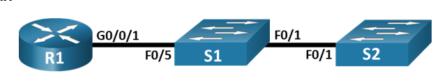
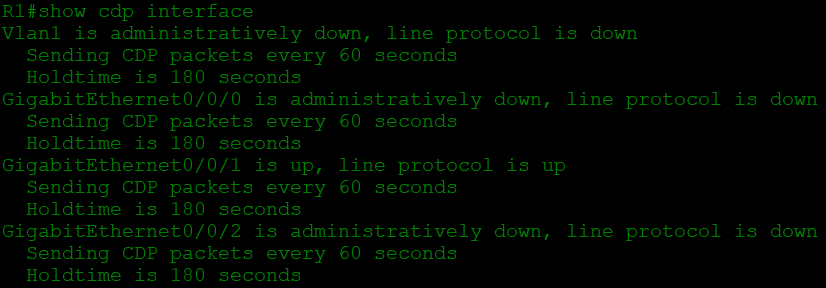
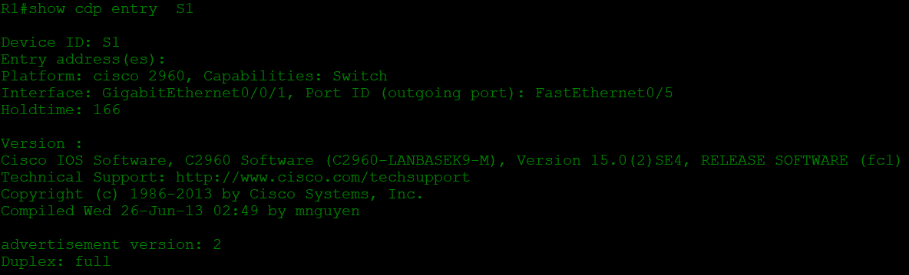
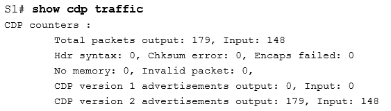
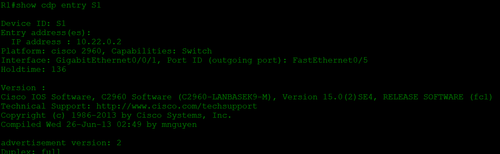
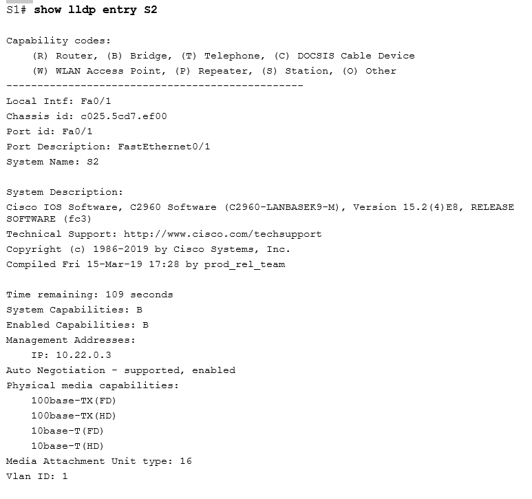
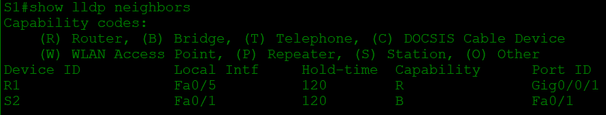
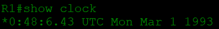
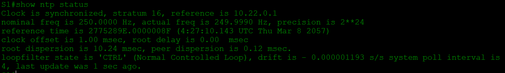
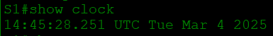

# Настройка протоколов CDP, LLDP и NTP
## Топология

## Таблица адресации
Устройство | Интерфейс | IP-адрес | Маска подсети | Шлюз по умолчанию
--- | --- | --- | --- | ---
R1 | Loopback 1 | 172.16.1.1 | 255.255.255.0 | _
_ | G0/0/1 | 10.22.0.1 | 255.255.255.0 | _
S1 | SVI VLAN 1 | 10.22.0.2 | 255.255.255.0 | 10.22.0.1
S2 | SVI VLAN 1 | 10.22.0.3 | 255.255.255.0 | 10.22.0.1
## Задачи
1. Создание сети и настройка основных параметров устройства
2. Обнаружение сетевых ресурсов с помощью протокола **CDP**
3. Обнаружение сетевых ресурсов с помощью протокола **LLDP**
4. Настройка и проверка **NTP**
## Решение
### 1. Создание сети и настройка основных параметров устройства
#### Шаг 1. Создайте сеть согласно топологии.
Подключите устройства, как показано в топологии, и подсоедините необходимые кабели.
#### Шаг 2. Настройте базовые параметры для маршрутизатора.
* Назначьте маршрутизатору имя устройства.
* Отключите поиск **DNS**, чтобы предотвратить попытки маршрутизатора неверно преобразовывать введенные команды таким образом, как будто они являются именами узлов.
* Назначьте *class* в качестве зашифрованного пароля привилегированного режима EXEC.
* Назначьте *cisco* в качестве пароля консоли и включите вход в систему по паролю.
* Назначьте *cisco* в качестве пароля VTY и включите вход в систему по паролю.
* Зашифруйте открытые пароли.
* Создайте баннер с предупреждением о запрете несанкционированного доступа к устройству.
* Настройка интерфейсов, перечисленных в таблице выше
* Сохраните текущую конфигурацию в файл загрузочной конфигурации.
#### Шаг 3. Настройте базовые параметры каждого коммутатора.
* Присвойте коммутатору имя устройства.
* Отключите поиск **DNS**, чтобы предотвратить попытки маршрутизатора неверно преобразовывать введенные команды таким образом, как будто они являются именами узлов.
* Назначьте *class* в качестве зашифрованного пароля привилегированного режима EXEC.
* Назначьте *cisco* в качестве пароля консоли и включите вход в систему по паролю.
* Назначьте *cisco* в качестве пароля VTY и включите вход в систему по паролю.
* Зашифруйте открытые пароли.
* Создайте баннер, который предупреждает всех, кто обращается к устройству, видит баннерное сообщение «*Только авторизованные пользователи!*».  
* Отключите неиспользуемые интерфейсы
* Сохраните текущую конфигурацию в файл загрузочной конфигурации.
### Часть 2. Обнаружение сетевых ресурсов с помощью протокола CDP
На устройствах *Cisco* протокол **CDP** включен по умолчанию. Воспользуйтесь **CDP**, чтобы обнаружить порты, к которым подключены кабели.
* На **R1** используйте соответствующую команду `show cdp interface`, чтобы определить, сколько интерфейсов включено **CDP**, сколько из них включено и сколько отключено.

Вопрос: Сколько интерфейсов участвует в объявлениях **CDP**? Какие из них активны? - Участвует 4 интерфейса, активен - один, **g0/0/1**
* На **R1** используйте соответствующую команду `show cdp entry S1`, чтобы определить версию IOS, используемую на S1.

Какая версия IOS используется на  S1? - **Version 15.0(2)SE4**
* На **S1** используйте соответствующую команду `show cdp traffic`, чтобы определить, сколько пакетов **CDP** было выданных.
В CPT данная функция не реализована, однако результат будет выглядеть подобным образом:

Сколько пакетов имеет выход CDP с момента последнего сброса счетчика? - **179**
* Настройте *SVI* для **VLAN 1** на **S1** и **S2**, используя IP-адреса, указанные в таблице адресации выше. Настройте шлюз по умолчанию для каждого коммутатора на основе таблицы адресов.
* На **R1** выполните команду `show cdp entry S1`  
Вопрос: Какие дополнительные сведения доступны теперь? - IP-адрес интерфейса **VLAN 1** на коммутаторе **S1**

* Отключить **CDP** глобально на всех устройствах командой `no cdp run`
### 3. Обнаружение сетевых ресурсов с помощью протокола LLDP
На устройствах Cisco протокол **LLDP** может быть включен по умолчанию. Воспользуйтесь **LLDP**, чтобы обнаружить порты, к которым подключены кабели.
* Введите соответствующую команду `lldp run`, чтобы включить **LLDP** на всех устройствах в топологии.
* На **S1** выполните соответствующую команду `show lldp entry S2`, чтобы предоставить подробную информацию о **S2**. 
В CPT данная функция не реализована, однако результат будет выглядеть подобным образом:

Что такое chassis ID  для коммутатора S2? - **c025.5cd7.ef00**
* Соединитесь через консоль на всех устройствах и используйте команды **LLDP**, необходимые для отображения топологии физической сети только из выходных данных команды `show`.

### 4. Настройка NTP
В части 4 необходимо настроить маршрутизатор **R1** в качестве сервера **NTP**, а коммутаторы **S1** и **S2** в качестве клиентов **NTP** маршрутизатора **R1**. Необходимо выполнить синхронизацию времени для *Syslog* и отладочных функций. Если время не синхронизировано, сложно определить, какое сетевое событие стало причиной данного сообщения.
#### Шаг 1. Выведите на экран текущее время.
Введите команду `show clock` для отображения текущего времени на **R1**. Запишите отображаемые сведения о текущем времени в следующей таблице.
Дата | Время | Часовой пояс | Источник времени
--- | --- | --- | ---
1 Марта 1993г. | 0:48:6.43 | UTC | не установлен

#### Шаг 2. Установите время.
С помощью команды `clock set` установите время на маршрутизаторе **R1**. Введенное время должно быть в формате *UTC*. 

#### Шаг 3. Настройте главный сервер NTP.
Настройте **R1** в качестве хозяина **NTP** с уровнем слоя *4* при помощи команды `ntp master 4`
#### Шаг 4. Настройте клиент NTP.
* Выполните соответствующую команду на **S1** и **S2**, чтобы просмотреть настроенное время. Запишите текущее время,  в следующей таблице.

Устройство | Дата | Время | Часовой пояс
--- | --- | --- | ---
S1 | 1 Марта 1993 г. | 0:58:7.954 | UTC
S2 | 1 Марта 1993 г. | 0:58:18.362 | UTC

* Настройте **S1** и **S2** в качестве клиентов **NTP**. Используйте соответствующие команды **NTP** для получения времени от интерфейса **G0/0/1 R1**, а также для периодического обновления календаря или аппаратных часов коммутатора.

`S*(config)# ntp server 10.22.0.1`

`S*(config)# ntp update-calendar`
#### Шаг 5. Проверьте настройку NTP.
* Используйте соответствующую команду `show ntp status` , чтобы убедиться, что **S1** и **S2** синхронизированы с **R1**.

* Выполните соответствующую команду на **S1** и **S2**, чтобы просмотреть настроенное время и сравнить ранее записанное время.

