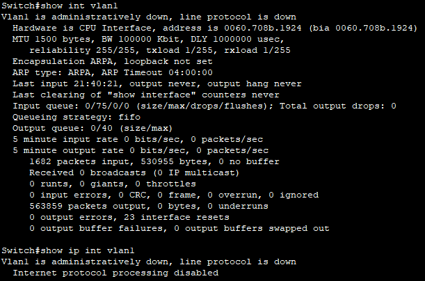
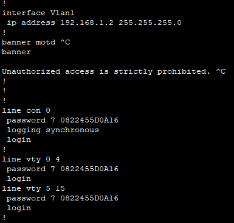

# Базовая настройка коммутатора
## Задачи
1. **Создание сети и проверка конфигурации коммутатора по умолчанию**
2. **Настройка основных параметров устройства**
  * Настройте базовые параметры коммутатора.
  * Настройте IP-адрес для ПК.
  3. **Проверка сетевых подключений**
  * Отобразите конфигурацию устройства.
  * Протестируйте сквозное соединение, отправив эхо-запрос.
  * Протестируйте возможности удаленного управления с помощью Telnet.
## Топология

## Таблица адрессации
Устройсво | Интерфейс | IP-адрес 
--- | --- | ---
S1 | VLAN 1  | 192.168.1.2 / 255.255.255.0
PC-A | NIC | 192.168.1.10 / 255.255.255.0
## Решение
1. **Создание сети и проверка конфигурации коммутатора по умолчанию**

Мы имеем ПК с программой эмуляции терминала (PC-A) и коммутатор Cisco 2960 (S1). Для начала работы нужну установить консольное соединение, поскольку . Для этого понадобится консольный кабель, подключенный разъёмом RS-232 в одноимённый порт ПК, и разъёмом 8P8C к консольному разъёму коммутатора.

Теперь можно переходить к проверке кофигурации коммутатора. Открываем программу эмуляции на ПК, нажимаем *Enter* и попадаем в пользовательский режим, вводим команду `enable` и попадаем в привелигированный режим (в дальнейшем все команды будут вводиться именнов нём ) и командой `show run`(`show running-config`) получаем необходимые нам сведения, а именно:

  * настроенных паролей и IP-адрессов в конфигурации не имеется
  * на коммутаторе есть 24 интерфейса FastEthernet и 2 интерфейса GigabitEthernet
  * диапозон значений, отоброжаемый в VTY-линиях: 0-4 и 5-15

Проверяем файл загрузочной конфигурации при помощи команды `show start` (`show startup-config`). Выводится сообщение **_startup-config is not present_**, озночающее, что никаких конфигураций в энергозависимой ОЗУ (NVRAM) коммутатора не сохранено и он находится на этапе "заводских настроек".

Теперь изучим SVI характеристики и IP-свойства интерфейса для сети VLAN-1. Используем команды `show int(interface) vlan1` и `show ip int(interface) vlan1` из которых узнаем, что сеть административно отключена, линейный протокол отключен, IP-адресс не присвоен а SVI имеет MAC адресс **0060.708b.1924**

Для дальнейшей работы подсоединим кабель Ethernet компьютера PC-A к порту 6 на коммутаторе, используем `show ip int brief` и видим что интерфейс FastEthernet 0/6 сменил свой статус на рабочий.

Вводим команду `show version` чтобы посмотреть версию ОС Cisco IOS - 15.0 (2) SE4.

Для изучения свойств по умолчанию интерфейса FastEthernet, который используется компьютером PC-A, используем `show int f0/6`. Интерфейс включен, имеет MAC-адресс 0060.2fda.7d06, заданные настройки: полнодуплексный способ связи и скорость 100 мб/с.

Просматриваем флеш-память. Вводим `dir flash` и видим флеш-каталог содержит только файл образа системы с именем _2960-lanbasek9-mz.150-2.SE4.bin_

2. **Настройка основных параметров устройства**

Входим в режим глобальной конфигурации при помощи `conf t` и построчно вводим следующие команды:

`no ip domain-lookup`

`hostname S1`

`service password-encryption`

`enable secret class`

`banner motd #`

`Unauthorized access is strictly prohibited. #`

  Теперь назначим IP-адрес интерфейсу SVI на коммутаторе, чтобы получить возможность удаленного управления коммутатором. Вводим последовательность команд:
  
`S1# configure terminal`

`S1(config)# interface vlan1`

`S1(config-if)# ip address 192.168.1.2 255.255.255.0`

`S1(config-if)# no shutdown`

`ctrl + z`

Ограничиваем доступ через порт консоли при помощи пароля _cisco_, а также задаем параметр **logging synchronous**, чтобы консольные сообщения не прерывали выполнение команд:

`S1# configure terminal`

`S1(config)# line con 0`

`S1(config-line)# password cisco`

`S1(config-line)# login`

`S1(config-line)# logging synchronous`

`ctrl + z`

Также настроим каналы виртуального соединения для удаленного управления (vty). Необходимо настроить пароль VTY, чтобы коммутатор разрешил доступ через Telnet.

`S1# configure terminal`

`S1(config)# line vty 0 15`

`S1(config-line)# password cisco`

`S1(config-line)# login`

`ctrl + z`

Команда `login` даёт возможность нам идентифицировать себя для системы.

3. **Проверка сетевых подключений**

Используем `show run` чтобы отобразить текущую конфигурацию коммутатора и пролистываем список, чтобы убедиться, что все внесенные нами изменения были сохранены.

 

Также проверяем параметры VLAN 1, командой 