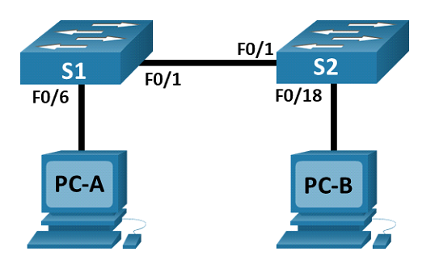

# MAC-адреса сетевых устройств
## Цели
1. **Создание и настройка сети**
2. **Изучение таблицы МАС-адресов коммутатора**
## Топология

## Таблица адрессации
Устройство | Интерфейс | IP-адрес | Маска подсети
--- | --- | --- | ---
S1 | VLAN 1	| 192.168.1.11	| 255.255.255.0
S2 | VLAN 1	| 192.168.1.12 | 255.255.255.0
PC-A | NIC	| 192.168.1.1 | 255.255.255.0
PC-B | NIC	| 192.168.1.2 | 255.255.255.0
## Решение
1. **Создание и настройка сети**
В нашей сети имеется 4 устройства: 2 ПК (PC-A и PC-B) c программой симуляции терминала и 2 коммутатора Cisco 2960 (S1 и S2). Подключаем PC-A к S1 и PC-B к S2 при помощи консольных кабелей. Также подключаем Ethernet кабелями
  * PC-A к порту F0/6 S1
  * S1 и S2 через порты F0/1
  * PC-B к S2 через порт F0/18

Переходим к настройкам базовых параметров коммутаторов