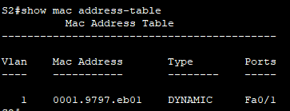

# MAC-адреса сетевых устройств
## Цели
1. **Создание и настройка сети**
2. **Изучение таблицы МАС-адресов коммутатора**
## Топология

## Таблица адрессации
Устройство | Интерфейс | IP-адрес | Маска подсети
--- | --- | --- | ---
S1 | VLAN 1	| 192.168.1.11	| 255.255.255.0
S2 | VLAN 1	| 192.168.1.12 | 255.255.255.0
PC-A | NIC	| 192.168.1.1 | 255.255.255.0
PC-B | NIC	| 192.168.1.2 | 255.255.255.0
## Решение
## 1. **Создание и настройка сети**
В нашей сети имеется 4 устройства: 2 ПК (PC-A и PC-B) c программой симуляции терминала и 2 коммутатора Cisco 2960 (S1 и S2). Подключаем PC-A к S1 и PC-B к S2 при помощи консольных кабелей. Также подключаем Ethernet кабелями
  * PC-A к порту F0/6 S1
  * S1 и S2 через порты F0/1
  * PC-B к S2 через порт F0/18

Переходим к настройкам IP-адрессов устройств и базовых параметров коммутаторов:
*настройку проводим на примере PC-A и S1 (в скобочках будут указаны аналогичные значения для PC-B и S2)
1. Устанавливаем для PC-A IPv4-адресс **192.168.1.1** (**192.168.1.2**) с маской 255.255.255.0 и шлюз по умолчанию **192.168.1.11** (**192.168.1.12**)
2. Открываем программу эмуляции и в режиме глобальной конфигурации вводим следующие команды 

`S1(config)# no ip domain-lookup`

`S1(config)# hostname S1(S2)`

`S1(config)# service password-encryption`

`S1(config)# enable secret class`

`S1(config)# interface vlan1`

`S1(config-if)# ip address 192.168.1.11 (192.168.1.12) 255.255.255.0`

`S1(config-if)# no shutdown`

`S1(config)# line con 0`

`S1(config-line)# password cisco`

`S1(config-line)# login`

`S1(config-line)# logging synchronous`

`S1(config)# line vty 0 15`

`S1(config-line)# password cisco`

`S1(config-line)# login`

## 2. **Изучение таблицы МАС-адресов коммутатора**
**Запишем МАС-адреса сетевых устройств**
  * Откроем командную строку на PC-A и вводим команду ipconfig /all, из которой видим, что MAC-адресс порта FastEternet - *0090.217D.775B*, адресс bluetooth соединения - *00D0.BC68.5A53*. Делаем то же самое на PC-B и получаем адресса FastEternet - *0003.E4AE.DBA6*, bluetooth соединения - *0000.0C18.B757*.
  * Подключимся к коммутаторам S1 и S2 через консоль и введём команду `show interface F0/1` на каждом коммутаторе, чтобы получить МАС-адрес коммутатора Fast Ethernet 0/1, у S1 - 
  это *0001.9797.eb01*, у S2 - *0060.2f23.6601*.

**Посмотрим таблицу MAC-адрессов комутатора.**\

  * Подключаемся к коммутатору S2 через консоль и в привилегированном режиме введти команду `show mac address-table`, видим что у нас сохранён только 1 адресс - интерфейс VLAN1, порт Fa0/1, и сравнивая с результатми предыдущега шага действительно видим что это адресс коммутатора S1

  * В привилегированном режиме введим команду `clear mac address-table dynamic` чтобы очистить таблицу MAC-адрессов. Снова быстро введим команду `show mac address-table`, но изменений в таблице не произошло.

**С компьютера PC-B отправим эхо-запросы устройствам в сети и просмотрим таблицу МАС-адресов коммутатора.**

  * На компьютере PC-B откроем командную строку и введём команду `arp -а`, увидим что никаких записей не найдено
  
  

  * Использеуем утилиту *ping* всё в той же командной строке PC-B, ко всем исходным IP-адрессам:
  
  `ping 192.168.1.1`

  `ping 192.168.1.2`

  `ping 192.168.1.11`

  `ping 192.168.1.12`

  Ответ получен от всех устройств, значит все работает корректно.
  
  * Используем `arp -а` ещё раз, и видим, что в ARP-кэше компьютера PC-B  появились дополнительные записи для всех сетевых устройств, которым были отправлены эхо-запросы
  
  

  * Подключившись через консоль к коммутатору S2, введём команду `show mac address-table` и видим что в таблицу MAC-фдрессов коммутатора добавились все устройства 

  

