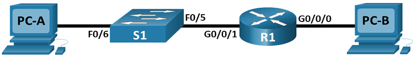
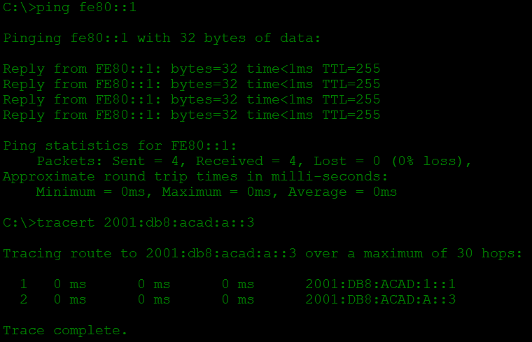
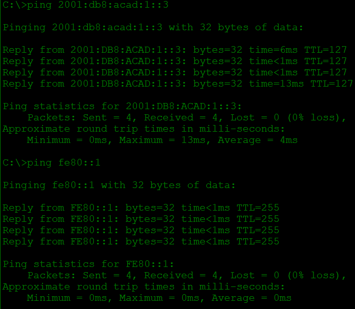

# Настройка IPv6-адресов на сетевых устройствах
## Задачи
1. **Настройка топологии и конфигурация основных параметров маршрутизатора и коммутатора**
2. **Ручная настройка IPv6-адресов**
3. **Проверка сквозного соединения**
## Топология

## Таблица адресации
Устройство | Интерфейс | IPv6-адрес | Link local IPv6-адрес | Длина префикса | Шлюз по умолчанию
--- | --- | --- | --- | --- | ---
R1 | G0/0/0 | 2001:db8:acad:a::1 | fe80::1 | 64 |	—
R1 |	G0/0/1 |	2001:db8:acad:1::1 | 	fe80::1 |	64 |	—
S1 |	VLAN 1 |	2001:db8:acad:1::b |	fe80::b |	64 |	—
PC-A |	NIC |	2001:db8:acad:1::3 |	SLACC |	64 |	fe80::1
PC-B |	NIC |	2001:db8:acad:a::3 |	SLACC |	64 |	fe80::1

## Решение
### 1. **Настройка топологии и конфигурация основных параметров маршрутизатора и коммутатора**
У нас имеется 2 ПК (PC-A и PC-B) с программой эмуляции терминала, 1 коммутатор Cisco 2960-24TT (S1) и 1 роутер ISR4331 (R1). Устанавливаем физическое подключение:

*  PC-A к порту f0/6 комутатора
*  f0/5 S1 r g0/0/1 роутера
*  g0/0/0 R1 с PC-B

После чего производим базовую настройку сетевых устройств

### 2. **Ручная настройка IPv6-адресов**
Начнем с роутера R1, включим на нем ipv6-маршрутизацию и назначим адреса интерфейсам, для этого в режиме глобальной конфигурации роутера вводим команды:

`R1(config)#ipv6 unicast-routing`

`R1(config)#int g0/0/0`

`R1(config-if)#no shut`

`R1(config-if)#ipv6 address fe80::1 link-local`

`R1(config-if)#ipv6 address 2001:db8:acad:a::1/64`

`R1(config-if)#int g0/0/1`

`R1(config-if)#no shut`

`R1(config-if)#ipv6 address fe80::1 link-local`

`R1(config-if)#ipv6 address 2001:db8:acad:1::1/64`

Теперь настроим ПК. Для PC-A устанавливаем адрес **2001:db8:acad:1::3** с длиной префикса **/64**, для PC-B **2001:db8:acad:a::3** с таким же префиксом, для обоих ПК устанавливаем шлюз по умолчанию **fe80::1**, поскольку этот локальный адрес установлен для роутера в обоих сетях. Локальные адреса самих ПК выставятся автоматически, благодаря SLAAC

займемся коммутатором. В режиме глобальной конфигурации вводим команды, 

`S1(config)# sdm prefer dual-ipv4-and-ipv6 default`

`S1(config)# end`

`S1# reload`

чтобы включить ipv6-маршрутизацию. Зададим адреса:

`S1(config)# int vlan1`

`S1(config-if)# ipv6 address fe80::b link-local`

`S1(config-if)# ipv6 address 2001:db8:acad:1::b/64`

### 3. **Проверка сквозного соединения**

Для проверки подключения, с PC-A отправим эхо-запрос на локальный адрес g0/0/1 и команду `tracert` к PC-B

На PC-B отправим эхо-запросы на PC-A и локальный адрес канала g0/0/0 на R1

