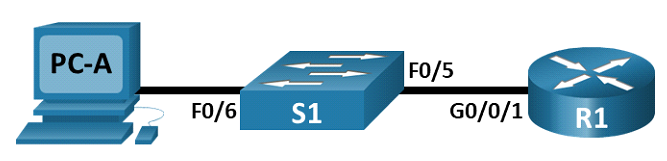
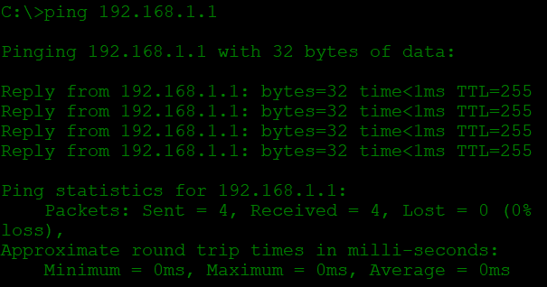
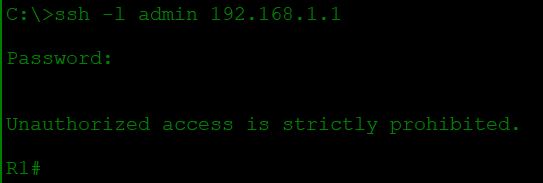

# Доступ к сетевым устройствам по протоколу SSH
## Задачи
1. **Настройка основных параметров устройства**
2. **Настройка маршрутизатора для доступа по протоколу SSH**
3. **Настройка коммутатора для доступа по протоколу SSH**
4. **SSH через интерфейс командной строки (CLI) коммутатора**
## Топология

## Таблица адрессации
Устройство | Интерфейс | IP-адрес | Маска подсети | Шлюз по умолчанию 
--- | --- | --- | --- | ---
R1 | G0/0/1 | 192.168.1.1 | 255.255.255.0 | - 
S1 | VLAN 1  | 192.168.1.11 | 255.255.255.0 | 192.168.1.1
PC-A | NIC | 192.168.1.3 | 255.255.255.0 | 192.168.1.1
## Решение 
### 1. **Настройка основных параметров устройства**
Создаем сеть, согласно топологии, после чего, с помощью консоли подключаемся к маршрутизатору и в режиме глобальной конфигурации вводим команды 

`Router(config)#hostname R1`

`R1(config)#no ip domain-lookup`

`R1(config)#enable secret class`

`R1(config)#line console 0`

`R1(config-line)#password cisco`

`R1(config-line)#login`

`R1(config)#line vty 0 4`

`R1(config-line)#password cisco`

`R1(config-line)#login`

`R1(config)#^Z`

`R1(config)#service password-encryption`

`R1(config)#banner motd #`

`Unauthorized access is strictly prohibited. #`

`R1(config)#interface g0/0/1`

`R1(config-if)#ip address 192.168.1.1 255.255.255.0`

`R1(config-if)#no shutdown`

`R1(config)#^Z`

`R1#copy run start`

Заходим в настройки PC-A  и устанавливаем ip-адрес с маской и шлюз по умолчанию согласно таблице адрессации. Проверяем соединение при помощи `ping`

### 2. **Настройка маршрутизатора для доступа по протоколу SSH**

Для генерации ключашифрования и дальнейшей активации протокола SSH, в режиме глобальной конфигурации роутера вводим следующие команды:

`R1(config)#ip domain-name otus.ru`

`R1(config)#crypto key generate rsa modulus general-keys 1024`

`R1(config)#ip ssh version 2`

`R1(config)#username admin privilege 15 secret Adm1nP@55`

`R1(config)# line vty 0 4`

`R1(config-line)#transport input ssh`

`R1(config-line)# login local`

`R1(config-line)#^z`

`R1#copy run start`

Проверяем подключение, через командную строку в PC-A 

