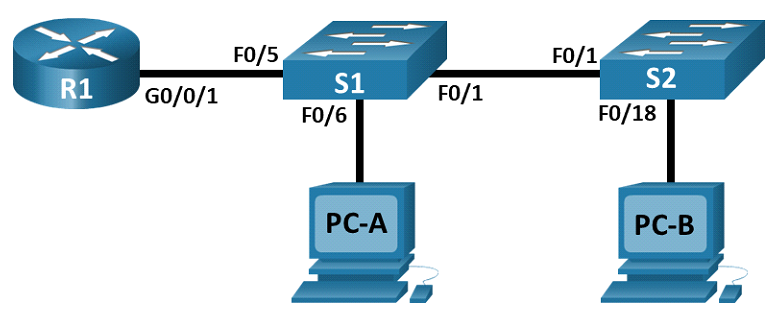
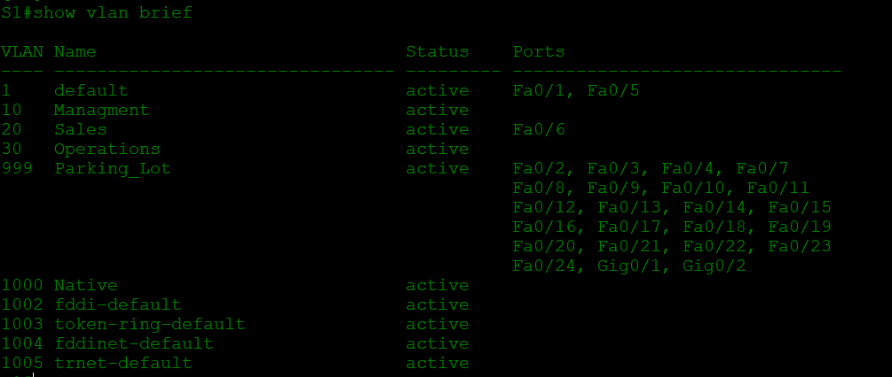

# Внедрение маршрутизации между виртуальными локальными сетями
## Задачи
1. **Создание сети и настройка основных параметров устройства**
2. **Создание сетей VLAN и назначение портов коммутатора**
3. **Настройка транка 802.1Q между коммутаторами**
4. **Настройка маршрутизации между сетями VLAN**
5. **Проверка, что маршрутизация между VLAN работает**
## Топология

## Таблица адрессации
Устройство | Интерфейс | IP-адрес | Маска подсети | Шлюз по умолчанию
--- | --- | --- | --- | ---
R1 | G0/0/1.10 | 192.168.10.1 | 255.255.255.0 | -
R1 | G0/0/1.20 | 192.168.20.1 | 255.255.255.0 | -
R1 | G0/0/1.30 | 192.168.30.1 | 255.255.255.0 | -
R1 | G0/0/1.1000 | - | - | - 
S1 | VLAN 10 | 192.168.10.11 | 255.255.255.0 | 192.168.10.1
S2 | VLAN 10 | 192.168.10.12 | 255.255.255.0 | 192.168.10.1
PC-A | NIC | 192.168.20.3 | 255.255.255.0 | 192.168.20.1
PC-A | NIC | 192.168.30.3 | 255.255.255.0 | 192.168.20.1

## Таблица VLAN
VLAN | Имя | Назначенный интерфейс
--- | --- | ---
10 | Управление | *S1: VLAN 10*; **S2: VLAN 10** 
20 | Sales | S1: F0/6
30 | Operations | S2: F0/18
999 | Parking_Lot | *S1: F0/2-4, F0/7-24, G0/1-2*; **S2: F0/2-17, F0/19-24, G0/1-2**
1000 | Собственная |

## Решение
### 1. **Создание сети и проверка конфигурации коммутатора по умолчанию**

Подключаем устройства согласно топологии и проводим базовую настройку устройств

 * На обоих ПК прописываем ip адрес самих хостов, а также шлюзов по умолчанию

 * На сетевых устройствах присваиваем имена, также устанавливаем пароли и баннер, зашифровыввем пароли и отключаем поиск DNS

### 2. **Создание сетей VLAN и назначение портов коммутатора**

* Создадим необходимые VLAN сети и присвоим им именна согласно таблице:

  `S1(config)#vlan 10`

  `S1(config-vlan)#name Management`

   Анологично повторяем для других VLAN.

* Настроим интерфейс управления и шлюз по умолчанию согласно таблице

  `S1(config)# interface vlan 10`

  `S1(config-if)# ip address 192.168.10.11 255.255.255.0`

  `S1(config-if)# no shutdown`

  `S1(config-if)# exit`

  `S1(config)# ip default-gateway 192.168.10.1`

* Назначим все неиспользуемые порты коммутатора на **VLAN Parking_Lot**, настроим их для статического режима доступа и административно деактивируем их:

  `S1(config)# interface range f0/2 - 4 , f0/7 - 24 , g0/1 - 2`

  `S1(config-if-range)# switchport mode access`

  `S1(config-if-range)# switchport access vlan 999`

  `S1(config-if-range)# shutdown`

* Назначим используемые порты соответствующей VLAN (указанной в таблице VLAN выше) и настроим их для режима статического доступа:

  `S1(config)# interface f0/6`

  `S1(config-if)# switchport mode access`

  `S1(config-if)# switchport access vlan 20`

 * Убедимся, что VLAN назначены на правильные интерфейсы при помощи команды `show vlan brief`

 

 Анологичным образом, успользуя данные из таблицы повторяем все действия для второго коммутатора

### 3. **Настройка транка 802.1Q между коммутаторами**