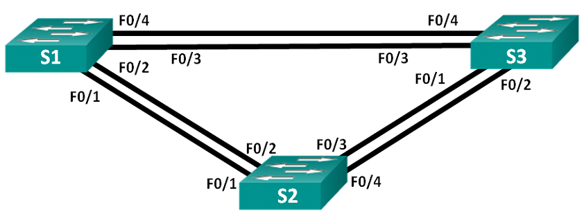
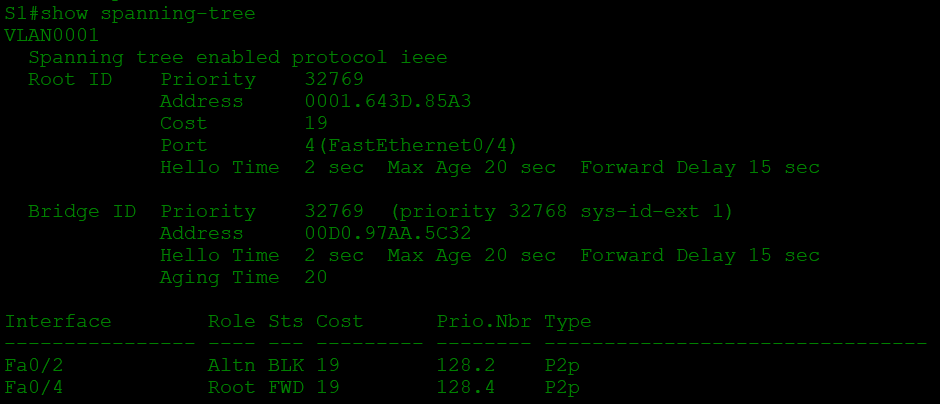
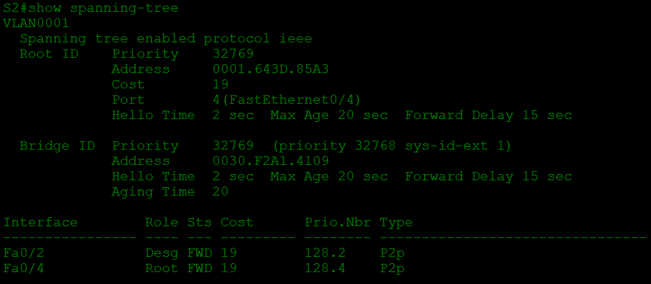
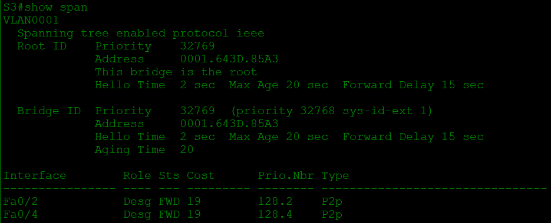
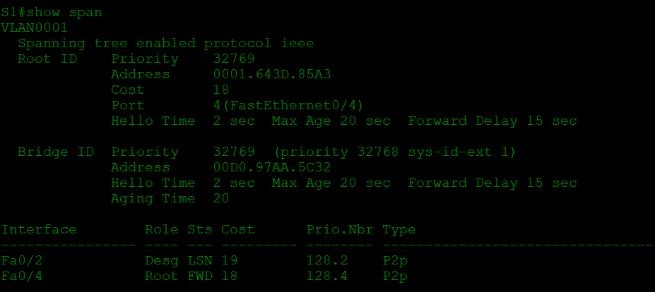
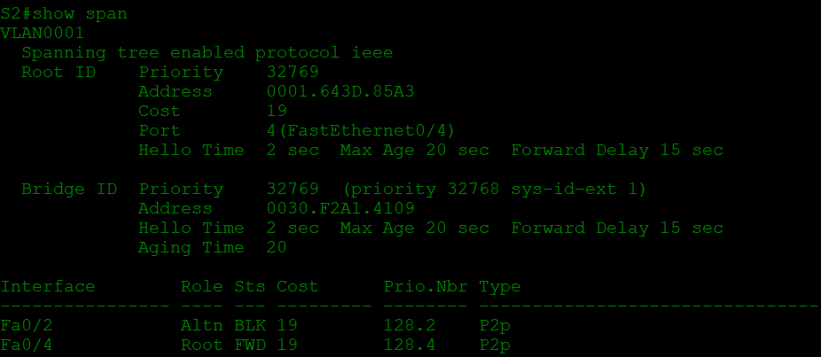

# Развертывание коммутируемой сети с резервными каналами
## Топология

## Таблица адресации

Устройство | Интерфейс | IP-адрес | Маска подсети
--- | --- | --- | --- 
S1 | VLAN 1 | 192.168.1.1 | 255.255.255.0
S2 | VLAN 1 | 192.168.1.2 | 255.255.255.0
S3 | VLAN 1 | 192.168.1.3 | 255.255.255.0

## Цели
1. **Создание сети и настройка основных параметров устройства**
2. **Выбор корневого моста**
3. **Наблюдение за процессом выбора протоколом STP порта, исходя из стоимости портов**
4.  **Наблюдение за процессом выбора протоколом STP порта, исходя из приоритета портов**

## Решение

### 1. **Создание сети и проверка конфигурации коммутатора по умолчанию**

Подключаем устройства согласно топологии и проводим базовую настройку устройств: на сетевых устройствах присваиваем имена, также устанавливаем пароли и баннер, зашифровыввем пароли,отключаем поиск DNS и задаем ip-адрес. Проверяем подключение отправкой эхо-запросов с каждого устройства к каждому соседу.

### 2. **Выбор корневого моста**

Отключаем все порты на коммутаторах:

`S1(config)# interface range f0/1-24, g0/1-2`

`S1(config-if-range)# shutdown`

`S1(config-if-range)# end`

Настраиваем подключенные порты в качестве транковых:

`S1(config)# interface range f0/1-4`

`S1(config-if-range)# switchport mode trunk`

`S1(config-if-range)# end`

Включаем порты f0/2 и f0/4

`S1(config)# interface range f0/2, f0/4`

`S1(config-if-range)# no shutdown`

`S1(config-if-range)# end`

Такие же команды на отсальных коммутаторах.

Теперь отобразим данные протокола командой `show spanning-tree` на всех устройствах

* S1

* S2

* S3

Теперь ответим на следующие вопросы:

1. Какой коммутатор является корневым мостом? - Корневым является **S3**

2. Почему этот коммутатор был выбран протоколом spanning-tree в качестве корневого моста? - Корневым устройством выбирается коммутатор с наименьшим идентефикатором (Switch ID), который состоит из приоритета и MAc-адреса устройства. В первую очередь рассмотривается приоритет, но он в данном случае на всех трех устройствах одинаковый, значит выбор происходил по значению MAC-адресса, который у **S3** оказался наименьшим.

3. Какие порты на коммутаторе являются корневыми портами? - у **S1** и **S2** корневые порты **f0/4**, у S**3** корневого порта нет, поскольку он является корневым устройством.

4. Какие порты на коммутаторе являются назначенными портами? - На **S1** назначенных портов нет, на **S2** назначенный порт **f0/2**, у **S3** назначенными портами являются и **f0/2** и **f0/4**.

5. Какой порт отображается в качестве альтернативного и в настоящее время заблокирован? - порт **f0/2** на **S1**.

6. Почему протокол spanning-tree выбрал этот порт в качестве невыделенного (заблокированного) порта? - Линк **S1 f0/2 - S2 f0/2** имеет наибольшую стоимость пути к корневому устройству. Этот линк необходимо перекрыть, заблокировав один из портов, основываясь уже на *Bridge ID* и *Port ID*.

### 3. **Наблюдение за процессом выбора протоколом STP порта, исходя из стоимости портов**

Мы уже знаем, что заблокированным портом является **f0/2** на **S1**. Изменим стоимость корневого порта этого коммутатора **f0/4** на 18, командой `spanning-tree vlan 1 cost 18`. Посмотрим изменнения протокола на коммутаторах **S1** И **S2** и увидим, что заблокированный ранее порт **f0/2** на **S1** назначенным, а находившийся на **S2** назначенный порт **f0/2**, теперь наоборот заблокированный:

Произошло это по причине того, что *STP* в первую очередь смотрит на стоимость а потом на ID, в первоначальном назначении протокол определялся по ID, поскольку стоимость была одинаковой.

Отменим изменения в стоимости командой `no spanning-tree vlan 1 cost 18` и заметим, как через короткое время протокол переназначил порты в первоначальный вид.