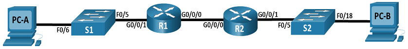
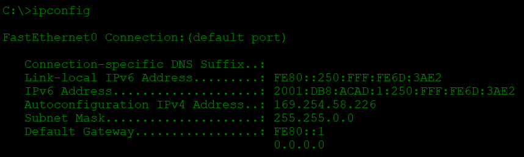
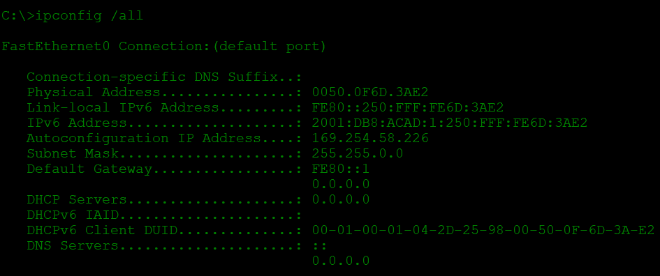
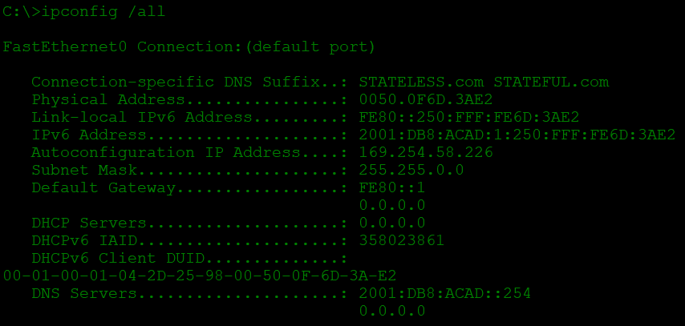
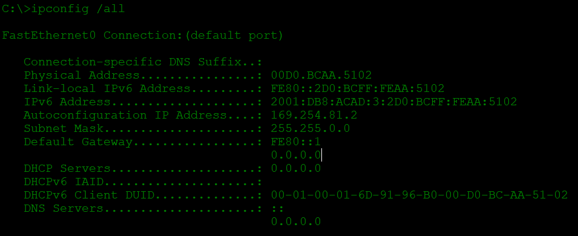

# Реализация DHCPv6
## Топология

## Таблица адресации

Устройство | Интерфейс | IPv6-адрес
--- | --- | --- 
R1 | G0/0/0 | **2001:db8:acad:2::1/64**; *fe80::1*
_ | G0/0/1 | **2001:db8:acad:1::1/64**; *fe80::1*
R2 | G0/0/0 | **2001:db8:acad:2::2/64**; *fe80::1*
_ | G0/0/1 | **2001:db8:acad:3::1/64**; *fe80::1*
PC-A | NIC | DHCP
PC-B | NIC | DHCP

## Задачи
1. **Создание сети и настройка основных параметров устройства**

2. **Проверка назначения адреса SLAAC от R1**

3. **Настройка и проверка сервера DHCPv6 без гражданства на R1**

4. **Настройка и проверка состояния DHCPv6 сервера на R1**

5. **Настройка и проверка DHCPv6 Relay на R2**

## Решение
### 1. **Создание сети и настройка основных параметров устройства**

Подключаем устройства согласно топологии. Для обоих ПК включаем автоматическую настройку IPv6. Сетевым устройствам задаём имена, выключаем поиск DNS, устанавливаем и зашифровываем пароли. У коммутаторов отключаем неиспользуемые порты. У маршрутизаторов настраиваем IPv6 на интерфейсах, а также настраиваем маршруты по умолчанию, указывающие на IP-адресс интерфейса G0/0/0 соседнего маршрутизатора.

### 2. **Проверка назначения адреса SLAAC от R1**

Командой `ipconfig` на **PC-A** убеждемся что он получает IPv6-адрес с помощью **SLAAC**

### 3. **Настройка и проверка сервера DHCPv6 без гражданства на R1**

* Выполниим команду `ipconfig /all` на **PC-A** и посмотрим на результат. Обратим внимание, что основной DNS-суффикс отсутствует. Также обратим внимание, что предоставленные адреса DNS-сервера являются адресами *«локального сайта anycast»*, а не одноадресные адреса, как ожидалось

* Настроим **R1** для предоставления *DHCPv6* без состояния для **PC-A**:
  * Создадим пул DHCP IPv6 на R1 с именем R1-STATELESS. В составе этого пула назначим адрес DNS-сервера как **2001:db8:acad: :1**, а имя домена — как **stateless.com**:

`R1(config)# ipv6 dhcp pool R1-STATELESS`

`R1(config-dhcp)# dns-server 2001:db8:acad::254`

`R1(config-dhcp)# domain-name STATELESS.com`
  * Настроим интерфейс **G0/0/1** на **R1**, чтобы предоставить флаг конфигурации **OTHER** для локальной сети **R1** и укажим только что созданный пул **DHCP** в качестве ресурса DHCP для этого интерфейса.

`R1(config)# interface g0/0/1`

`R1(config-if)# ipv6 nd other-config-flag` 

`R1(config-if)# ipv6 dhcp server R1-STATELESS`
  * Сохраним текущую конфигурацию в файл загрузочной конфигурации и проверим вывод `ipconfig /all` на PC-A

  

### 4. **Настройка и проверка состояния DHCPv6 сервера на R1**

Создадим пул *DHCPv6* на **R1** для сети **2001:db8:acad:3:aaa::/80**. Это предоставит адреса локальной сети, подключенной к интерфейсу **G0/0/1** на **R2**. В составе пула зададим DNS-сервер **2001:db8:acad: :254** и зададим доменное имя *STATEFUL.com*:

`R1(config)# ipv6 dhcp pool R2-STATEFUL`

`R1(config-dhcp)# address prefix 2001:db8:acad:3:aaa::/80`

`R1(config-dhcp)# dns-server 2001:db8:acad::254`

`R1(config-dhcp)# domain-name STATEFUL.com`

Назначьте только что созданный пул *DHCPv6* интерфейсу **g0/0/0** на **R1**.

`R1(config)# interface g0/0/0`

`R1(config-if)# ipv6 dhcp server R2-STATEFUL`

### 5. **Настройка и проверка DHCPv6 Relay на R2**

* Включиим **PC-B** и проверим адрес **SLAAC**, который он генерирует

* Настройте **R2** в качестве агента DHCP-ретрансляции для локальной сети на **G0/0/1**.

`R2 (config) # int g0/0/1`

`R2(config-if)# ipv6 nd managed-config-flag`

`R2(config-if)# ipv6 dhcp relay destination 2001:db8:acad:2::1 g0/0/0`

# Реализация DHCPv4
## Таблица адресации

Устройство | Интерфейс | IP-адрес | Маска подсети | Шлюз по умолчанию
--- | --- | --- | --- | ---
R1 | G0/0/0 | 10.0.0.1 | 255.255.255.252 | _
_ | G0/0/1 | _ | _ | _
_ | G0/0/1.100 | _ | _ | _
_ | G0/0/1.200 | _ | _ | _
_ | G0/0/1.1000 | _ | _ | _
R2 | G0/0/0 | 10.0.0.2 | 255.255.255.252 | _
_ | G0/0/1 | _ | _ | _
S1 | VLAN 200 | _ | _ | _
S2 | VLAN 1 | _ | _ | _
PC-A | NIC | DHCP | DHCP | DHCP
PC-B | NIC | DHCP | DHCP | DHCP
## Таблица VLAN
VLAN | Имя | Назначенный интерфейс
--- | --- | ---
1 | Нет | *S2: F0/18
100 | Clients | S1: F0/6
200 | Managment | S1: VLAN 200  
999 | Parking_Lot | S1: F0/1-4, F0/7-24, G0/1-2
1000 | Собственная |
## Задачи

1. **Настройка и проверка двух серверов DHCPv4 на R1**

2. **Настройка и проверка DHCP-ретрансляции на R2**
## Решение

### 1. Настройка и проверка двух серверов DHCPv4 на R1
