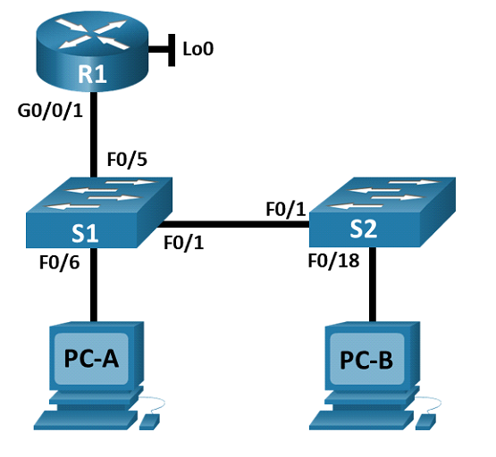
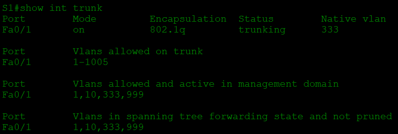
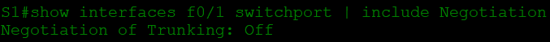
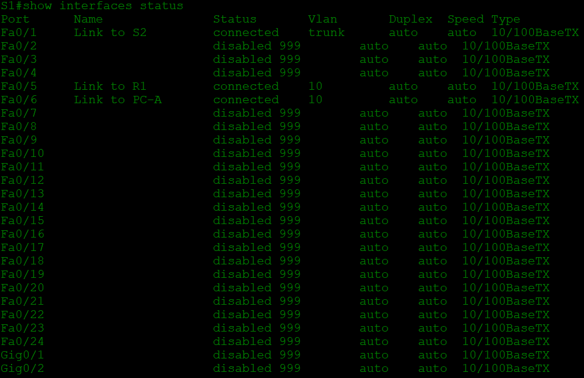
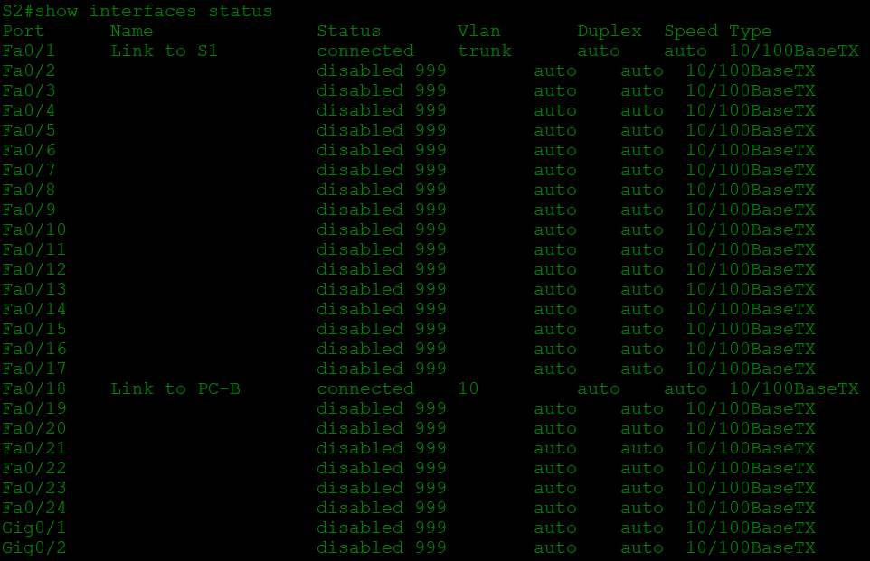
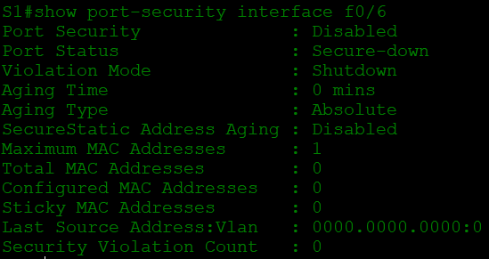
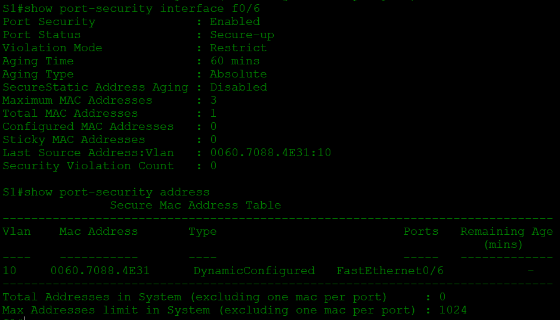

# Конфигурация безопасности коммутатора
## Топология

## Таблица адресации

Устройство | interface/vlan | IP-адрес | Маска подсети
--- | --- | --- | ---
R1 | G0/0/1 | 192.168.10.1 | 255.255.255.0
_ | Loopback 0 | 10.10.1.1 | 255.255.255.0
S1 | VLAN 10 | 192.168.10.201 | 255.255.255.0
S2 | VLAN 10 | 192.168.10.202 | 255.255.255.0
PC-A | NIC | DHCP | 255.255.255.0
PC-B | NIC | DHCP | 255.255.255.0

## Цели

1. Настройка основного сетевого устройства
 * Создайте сеть.
 * Настройте маршрутизатор R1.
 * Настройка и проверка основных параметров коммутатора
2. Настройка сетей VLAN
 * Сконфигруриуйте VLAN 10.
 * Сконфигруриуйте SVI для VLAN 10.
 * Настройте VLAN 333 с именем Native на S1 и S2.
 * Настройте VLAN 999 с именем ParkingLot на S1 и S2.
3. Настройки безопасности коммутатора.
 * Реализация магистральных соединений 802.1Q.
 * Настройка портов доступа
 * Безопасность неиспользуемых портов коммутатора
 * Документирование и реализация функций безопасности порта.
 * Реализовать безопасность DHCP snooping .
 * Реализация PortFast и BPDU Guard
 * Проверка сквозной связанности.

 ## Решение

### 1. Настройка основного сетевого устройства

Создаём сеть согласно топологии. Переходим на **R1** и загружаем следующий конфигурационный скрипт:

`enable`

`configure terminal`

`hostname R1`

`no ip domain lookup`

`ip dhcp excluded-address 192.168.10.1 192.168.10.9`

`ip dhcp excluded-address 192.168.10.201 192.168.10.202`

`!`

`ip dhcp pool Students`

 `network 192.168.10.0 255.255.255.0`

 `default-router 192.168.10.1`

 `domain-name CCNA2.Lab-11.6.1`

`!`

`interface Loopback0`

 `ip address 10.10.1.1 255.255.255.0`

`!`

`interface GigabitEthernet0/0/1`

 `description Link to S1`

 `ip dhcp relay information trusted`

 `ip address 192.168.10.1 255.255.255.0`

 `no shutdown`

`!`

`line con 0`

 `logging synchronous`

 `exec-timeout 0 0`

Проверяем текущую конфигурацию командой `R1# show ip interface brief`, проверяем IP-адресацию и состояние интерфейсов. Сохраняем конфигурацию.

Теперь настроим основные параметры коммутаторов:

 * Настроим имя хоста для коммутаторов S1 и S2.

 * Запретим нежелательный поиск в DNS.

 * Настроим описания интерфейса для портов, которые используются в S1 и S2:

`S1(config)# interface f0/1`

`S1(config-if)# description Link to S2`

`S1(config-if)# interface f0/5`

`S1(config-if)# description Link to R1`

`S1(config-if)# interface f0/6`

`S1(config-if)# description Link to PC-A`

`S2(config)# interface f0/1`

`S2(config-if)# description Link to S1`

`S2(config-if)# interface f0/18`

`S2(config-if)# description Link to PC-B`

 * Установим для шлюза по умолчанию для VLAN управления значение 192.168.10.1 на обоих коммутаторах.

### 2. Настройка сетей VLAN

Настроим VLAN на коммутаторах согласно таблице адресации

`S1(config)# vlan 10`

`S1(config-vlan)# name Management`

`S1(config)# interface vlan 10`

`S1(config-if)# ip address 192.168.10.201 255.255.255.0`

`S1(config-if)# description Management SVI`

`S1(config-if)# no shutdown`

`S1(config-if)# ex`

`S1(config)# vlan 333`

`S1(config-vlan)# name Native`

`S1(config-vlan)# ex`

`S1(config-vlan)# vlan 999`

`S1(config-vlan)# name ParkingLot`

Анологично для **S2**.

### 3. Настройки безопасности коммутатора

Настроим все магистральные порты **Fa0/1** на обоих коммутаторах для использования **VLAN 333** в качестве *native VLAN*.

`S1(config)# interface f0/1`

`S1(config-if)# switchport mode trunk`

`S1(config-if)# switchport trunk native vlan 333`

Убедимся, что режим транкинга успешно настроен на коммутаторах при помощи `show interface trunk`

Такой же результат должен быть на S2.

Отключим согласование DTP **F0/1** на **S1** и **S2** командой `S..(config-if)#switchport nonegotiate`  и проверим с помощью команды `show interfaces f0/1 switchport | include Negotiation`

Командами `S..(config-if)# switchport mode access` ; `S..(config-if)# switchport access vlan 10` настроим интерфейсы в качестве портов доступа. На **S1** это будут интерфейсы *f0/5-6*, на **S2** - *f0/18*. После чего, на **S1** и **S2** переместим  *VLAN 1* в *VLAN 999* и отключим неиспользуемые порты. Убедимся, что неиспользуемые порты отключены и связаны с VLAN 999, введя команду  `show interfaces status`

Займемся документированием и реализацией функций безопасности порта. На **S1**, введём команду `show port-security interface f0/6`  для отображения настроек по умолчанию безопасности порта для интерфейса **F0/6** и заполним таблицу

Функция | Настройка по умолчанию
--- | ---
Защита портов |	Disabled
Максимальное количество записей MAC-адресов	| 1
Режим проверки на нарушение безопасности | Shutdown
Aging Time | 0 mins	
Aging Type | Absolute	
Secure Static Address Aging | Disabled	
Sticky MAC Address | 0	

Теперь включим защиту порта на **F0/6** со следующими настройками:
 * Максимальное количество записей MAC-адресов: 3 - `switchport port-security maximum 3`
 * Режим безопасности: restrict - `switchport port-security violation restrict`
 * Aging time: 60 мин - `switchport port-security aging time 60`
 * Aging type: неактивный - `switchport port-security aging type inactivity`

Проверим настройки безопасности порта **f0/6** теперь (параметр *Aging type* в CPT не настроить, он остался без изменений)

